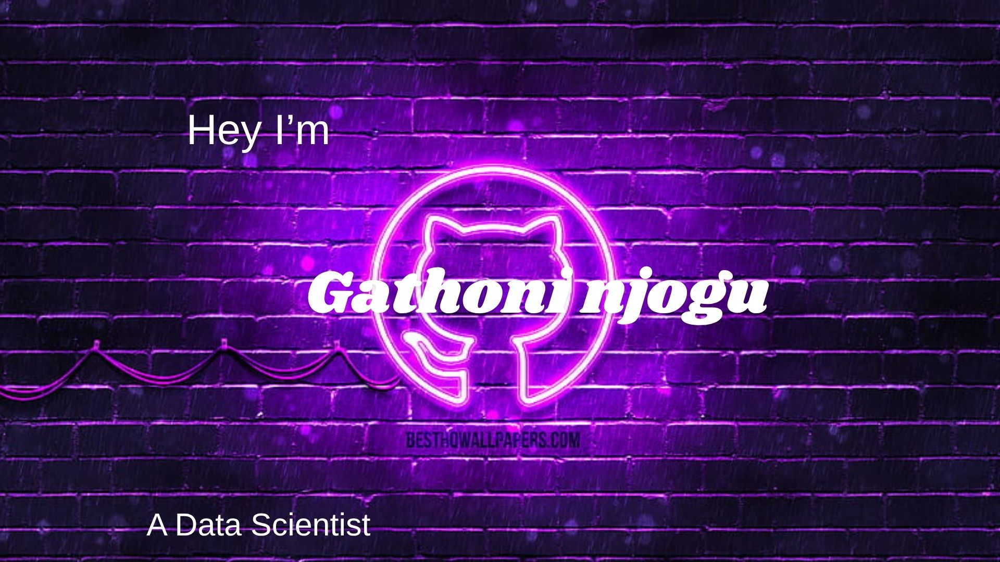

**hey, I am Maureen!**

I'm a data scientist with love for both analytics and machine learning am working on learning as many projects and mostly interested in making chatbots,also visualizing the data to see various insights

**my skills**
the first project i did was detecting churn in banks and this project i not only found churns but also checked on the best model used for the particular project
 i also love querying data from mysql its always so mysterious and fun ato do
 Moreover i love using visualization tools like tableau that helps in showing insights in data
 
 ** fun facts**
 Aside from coding i also love media production especially camera directing,youtube streaming and videography this is fun to do and always relaxes my mind after coding
 
 **current tech skill**
 my current read is on excel am learning it 
